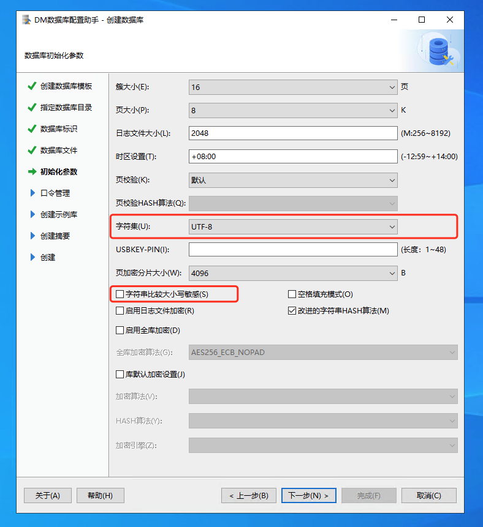

# 武汉达梦数据库

[武汉达梦数据库](https://www.dameng.com/)

## 安装注意事项

::: tip 注意
初始化数据库实例时，编码需要改为```UTF-8```，去掉```字符串大小写敏感```选项。一旦数据库实例被创建参数将不可修改。
:::



## 版本区别

| 对比项                   | 开发版                                  | 标准版                            | 企业版                                              | 安全版                                              |
|-----------------------|--------------------------------------|--------------------------------|--------------------------------------------------|--------------------------------------------------|
| 最大连接数                 | 无限制                                  | 25                             | 65536                                            | 65536                                            |
| 最大物理 CPU 数量           | 2                                    | 2                              | 无限制                                              | 无限制                                              |
| 最大逻辑 CPU 核数           | 32                                   | 32                             | 无限制                                              | 无限制                                              |
| 使用时间                  | 一年                                   | 无限制                            | 无限制                                              | 无限制                                              |
| 硬件平台支持                | Windows、Linux 6 系列、xLinux 7 系列、龙芯、飞腾 | Windows 全系列、Linux 全系列、龙芯、飞腾、神威 | Windows 全系列、Linux 全系列、龙芯、飞腾、申威、泰山、海光、兆芯、Power、安腾 | Windows 全系列、Linux 全系列、龙芯、飞腾、申威、泰山、海光、兆芯、Power、安腾 |
| 最大存储容量                | 500 GB                               | 500 GB                         | 无限制                                              | 无限制                                              |
| 单表最大行数                | 1 亿                                  | 1 亿                            | 无限制                                              | 无限制                                              |
| 大表最大列数                | 1024                                 | 1024                           | 2048                                             | 2048                                             |
| 列存储                   | 不支持                                  | 不支持                            | 支持                                               | 支持                                               |
| 分区表                   | 不支持                                  | 不支持                            | 支持                                               | 支持                                               |
| 并行查询                  | 不支持                                  | 不支持                            | 支持                                               | 支持                                               |
| 闪回查询                  | 不支持                                  | 不支持                            | 支持                                               | 支持                                               |
| 分析函数与自定义聚集函数          | 不支持                                  | 不支持                            | 支持                                               | 支持                                               |
| 虚拟数据库 VPD             | 不支持                                  | 不支持                            | 支持                                               | 支持                                               |
| DBMS_SQL 包            | 不支持                                  | 不支持                            | 支持                                               | 支持                                               |
| 存储过程调试功能              | 不支持                                  | 不支持                            | 支持                                               | 支持                                               |
| XML 支持                | 不支持                                  | 不支持                            | 支持                                               | 支持                                               |
| JSON 支持               | 不支持                                  | 不支持                            | 支持                                               | 支持                                               |
| 空间数据库支持               | 不支持                                  | 不支持                            | 支持                                               | 支持                                               |
| 全文索引支持                | 不支持                                  | 不支持                            | 支持                                               | 支持                                               |
| DBLINK 功能             | 不支持                                  | 不支持                            | 支持                                               | 支持                                               |
| DMHS 支持               | 不支持                                  | 不支持                            | 支持                                               | 支持                                               |
| 数据守护集群 DataWatch      | 不支持                                  | 不支持                            | 支持                                               | 支持                                               |
| 读写分离集群 DMRWC          | 不支持                                  | 不支持                            | 支持                                               | 支持                                               |
| 共享存储集群 DMDSC          | 不支持                                  | 不支持                            | 支持                                               | 支持                                               |
| 大规模并行处理集群 DMMPP       | 不支持                                  | 不支持                            | 支持                                               | 支持                                               |
| 数据复制 Data Replication | 不支持                                  | 不支持                            | 支持                                               | 支持                                               |
| 企业管理工具 DEM            | 不支持                                  | 不支持                            | 支持                                               | 支持                                               |
| 备份还原接口 SBT            | 不支持                                  | 不支持                            | 支持                                               | 支持                                               |
| 嵌入式 Pro*C             | 不支持                                  | 不支持                            | 支持                                               | 支持                                               |
| 外部函数扩展                | 不支持                                  | 不支持                            | 支持                                               | 支持                                               |
| 外部表                   | 不支持                                  | 不支持                            | 支持                                               | 支持                                               |
| 通讯加密                  | 不支持                                  | 不支持                            | 支持                                               | 支持                                               |
| 存储加密                  | 不支持                                  | 不支持                            | 支持                                               | 支持                                               |
| 加密引擎                  | 不支持                                  | 不支持                            | 不支持                                              | 支持                                               |
| 三权分立                  | 不支持                                  | 不支持                            | 支持                                               | 支持                                               |
| 四权分立                  | 不支持                                  | 不支持                            | 不支持                                              | 支持                                               |
| 自主访问控制                | 不支持                                  | 不支持                            | 支持                                               | 支持                                               |
| 强制访问控制                | 不支持                                  | 不支持                            | 不支持                                              | 支持                                               |
| 审计和实时侵害检测             | 不支持                                  | 不支持                            | 不支持                                              | 支持                                               |
| 客体重用                  | 不支持                                  | 不支持                            | 不支持                                              | 支持                                               |
| 资源限制                  | 不支持                                  | 不支持                            | 不支持 IP 和时间段限制                                    | 支持                                               |